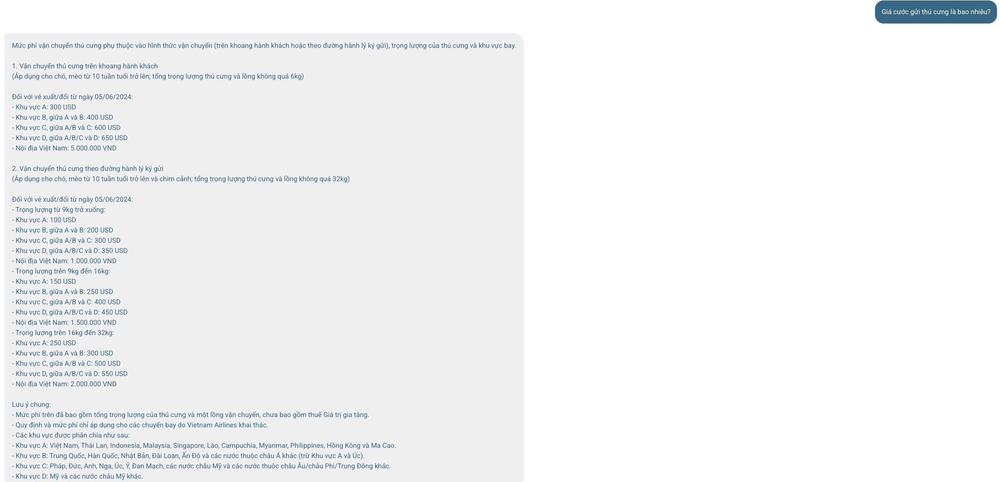
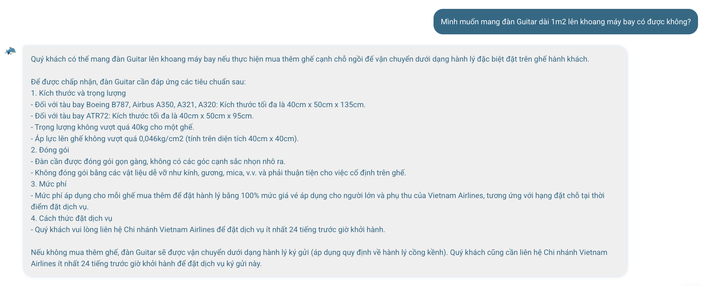
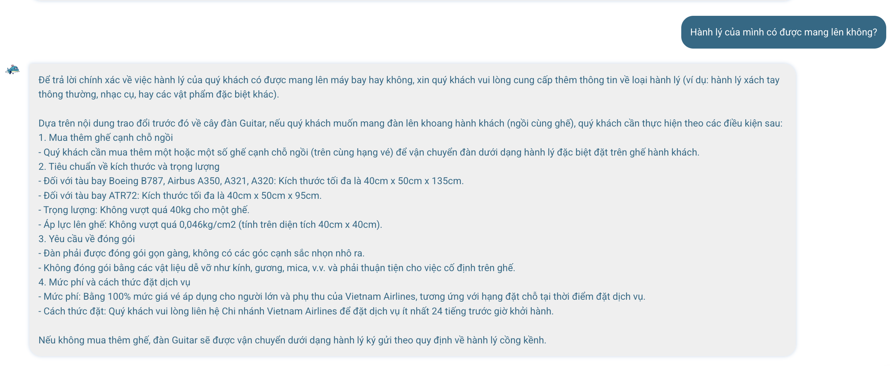
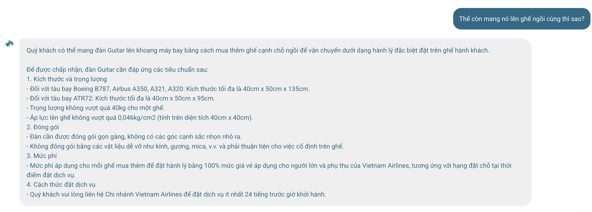
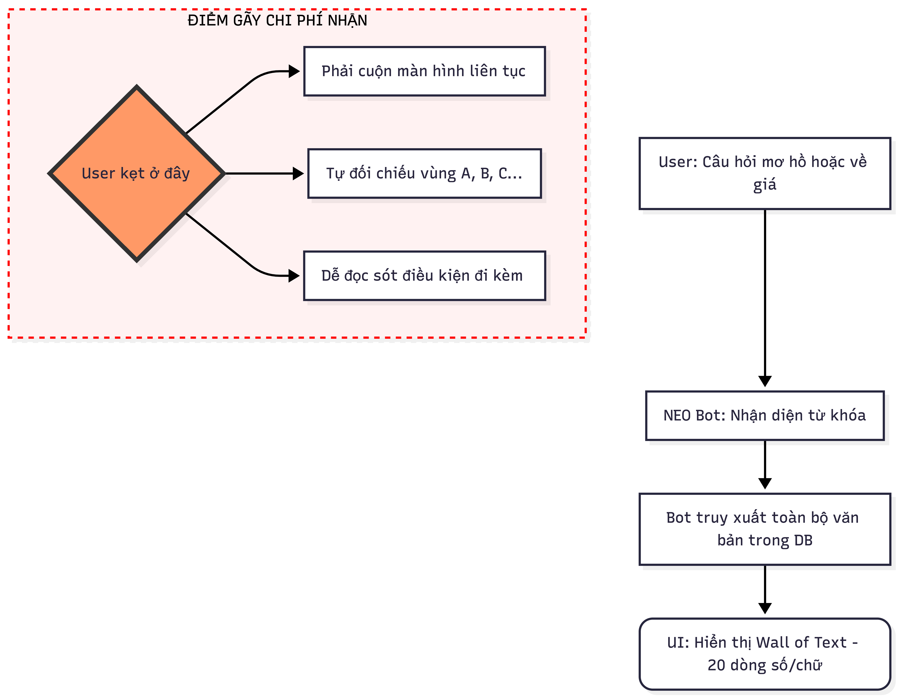
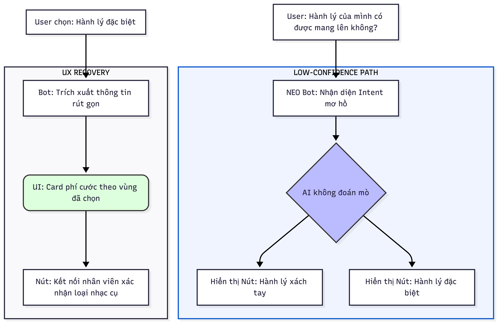

# BÁO CÁO: MỔ APP AI THẬT — NEO BOT

## 1. Sản phẩm & Feature
*   **Sản phẩm:** Vietnam Airlines — NEO (Chatbot).
*   **AI Feature:** Tra cứu thông tin hành lý và giá cước.

## 2. Dùng thử: Promise vs Reality
*   **Promise:** Một trợ lý ảo thông minh giúp giải đáp nhanh các thắc mắc phức tạp mà không cần đọc manual.
*   **Reality:** AI đang dừng lại ở mức **"Máy tìm kiếm văn bản"**. Thay vì trả lời trực tiếp, nó quăng cho user một "bức tường văn bản" (Wall of text) bắt user tự lọc.
*   **Hậu quả:** User bị quá tải nhận thức (Cognitive Load), dễ đọc nhầm thông tin giữa các vùng/hạng vé.

> 
*   **Câu hỏi:** "Giá cước gửi thú cưng là bao nhiêu?"
*   **Note:** Minh họa cho lỗi **"Wall of Text"**. AI không bóc tách dữ liệu mà trả về danh sách thô, bắt người dùng tự tra cứu vùng A, B, C...

---

## 3. Phân tích 4 Paths (Trái tim của bài báo cáo)

| Path | Câu hỏi thực hiện | Phân tích từ thực tế |
|---|---|---|
| **Happy** | "Mình muốn mang đàn Guitar dài 1m2 lên khoang máy bay có được không?" | AI tìm đúng dữ liệu về nhạc cụ, nhưng trình bày kém (liệt kê cả Boeing, Airbus chung một chỗ).   |
| **Low-confidence** | "Hành lý của mình có được mang lên không?" | Câu hỏi rất mơ hồ. AI không hỏi lại (Clarify) mà tự đoán rồi liệt kê cả "thú cưng" lẫn "hành lý xách tay". Đây là điểm gãy nặng nhất.   |
| **Failure** | (Quan sát chung) | Không có nút "Báo lỗi" hay "Tôi không tìm thấy ý mình cần". User chỉ có thể thoát flow. |
| **Correction** | "Thế còn mang **nó** lên ghế ngồi cùng thì sao?" | **Điểm sáng:** AI nhận diện được đại từ "nó" thay thế cho "đàn Guitar" ở câu trước. Lớp Context Memory làm việc tốt.   |

---

## 4. Viết Finding thành Quyết định Product (Finding → Decision)

**Finding:** Khi user hỏi các thông tin có nhiều điều kiện ràng buộc (vùng địa lý, kích thước tàu bay), AI trả về toàn bộ tài liệu thô thay vì một câu trả lời đã tổng hợp.
*   **Lỗi thuộc layer:** Data/Tool (Truy xuất thừa) + UX Recovery (Thiếu tương tác lọc thông tin).
*   **Quyết định sửa bằng:** 
    1.  **AI Requirement:** Nếu dữ liệu trả về có >3 phân loại (ví dụ: Vùng A, B, C), AI không được hiện Text ngay.
    2.  **UX Decision:** Kích hoạt **Low-confidence path** bằng cách hiển thị các nút lựa chọn (Buttons) để thu hẹp phạm vi.
    3.  **UI Pattern:** Sử dụng **Interactive Cards** để tách biệt các mức giá, thay vì liệt kê trong 1 khung chat.

---

## 5. Sketch As-is / To-be

### **Cột As-is:**
1.  **User:** Hỏi câu hỏi mơ hồ hoặc câu hỏi về giá.
2.  **NEO:** Đổ ra 20 dòng text chi chít số.
3.  **Điểm gãy:** User kẹt ở việc phải cuộn màn hình và tự đối chiếu vùng địa lý để biết mình phải trả bao nhiêu tiền.

### **Cột To-be:**
1.  **User:** "Hành lý của mình có được mang lên không?"
2.  **NEO (Clarification):** Không đoán mò. Hiện 2 nút: `[Hành lý xách tay]` / `[Hành lý đặc biệt (Thú cưng, Nhạc cụ...)]`.
3.  **User chọn [Hành lý đặc biệt].**
4.  **NEO:** Hiện Card thông tin rút gọn về phí + Nút `[Kết nối nhân viên]` để xác nhận loại nhạc cụ cụ thể.

---

## 6. Tổng kết SPEC Field (Nộp bài)
*   **Top failure mode:** AI đoán sai intent khi user hỏi mơ hồ (Screenshot 4).
*   **Cách xử lý:** Thêm `Threshold` (ngưỡng tự tin). Nếu không chắc chắn user hỏi loại hành lý nào, buộc phải hỏi lại bằng Buttons.
*   **Learning signal:** Lưu lại các câu hỏi mà user phải gõ lại 2 lần để cập nhật tập Test set cho Intent nhận diện nhạc cụ/vật phẩm lạ.
